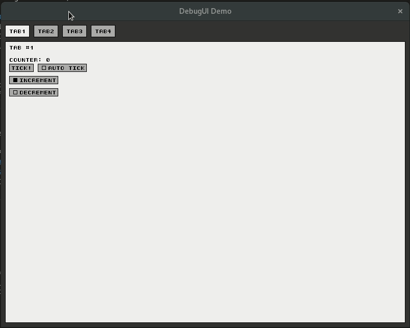

# Immediate Mode Debug UI

* Requires SDL2
* Example code in demo/main.c



# Building & Installing

```
mkdir build
cd build
cmake ..
sudo make install
```

# Using

Include after defining `DUI_IMPLEMENTATION` in *one* source file.

```
#define DUI_IMPLEMENTATION
#include <DUI/DUI.h>
```

# CMake

You can include DUI with CMake by using:

```
FIND_PACKAGE(DUI CONFIG REQUIRED)
```

and then link it with:

```
TARGET_LINK_LIBRARIES(
    target
    PRIVATE
        DUI::DUI
)
```

# Demo

```
cc -o duidemo -I include -I/usr/include/SDL2 demo/main.c -lSDL2 && ./duidemo
```